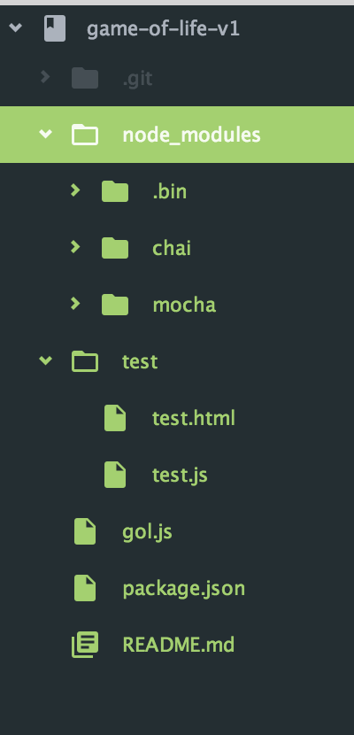

# Javascript Ramp up

## Setup a basic JS node app

* Create directory
* `git init`
* `npm init`
* `npm install mocha --save`
* `npm install chai --save`
* `mkdir test`
* `touch test/test.html`
* `touch test/test.js`
* `touch foo.js`

### App structure

### test.html
```html
<html>
<head>
  <meta charset="utf-8">
  <title>Mocha Tests</title>
  <link href="https://cdn.rawgit.com/mochajs/mocha/2.2.5/mocha.css" rel="stylesheet" />
</head>
<body>
  <div id="mocha"></div>

  <script src="https://cdn.rawgit.com/jquery/jquery/2.1.4/dist/jquery.min.js"></script>
  <script src="https://cdn.rawgit.com/Automattic/expect.js/0.3.1/index.js"></script>
  <script src="https://cdn.rawgit.com/mochajs/mocha/2.2.5/mocha.js"></script>
  <script src="http://chaijs.com/chai.js"></script>

  <script>mocha.setup('bdd')</script>
  <script src="test.js"></script>
  <script src="../foo.js"></script>
  <script>
    mocha.checkLeaks();
    mocha.globals(['jQuery']);
    mocha.run();
  </script>
</body>
</html>
```

### foo.js
```js
function foo () {
  return "bar"
};
```

### test.js
```js
var assert = chai.assert;

describe('Basic string Test', function() {
  it('Tests the length of the string', function() {
    var length = foo().length;
    assert.equal(length, 3);
  })
});
```
## Deploying the App Locally
### Dependencies
* Node 0.12.7
* NPM 2.11.3

### View the App locally

* Clone the repository.
* Visit the repository directory.
* `npm install`
* open the page `gol.html` in your browser to see the game of life (v1).
* open the page `test/test.html` to run tests in a browser.

## Todo
* Create an infinite Board
* Use a functional programming approach
* User react-flux to allow user interaction